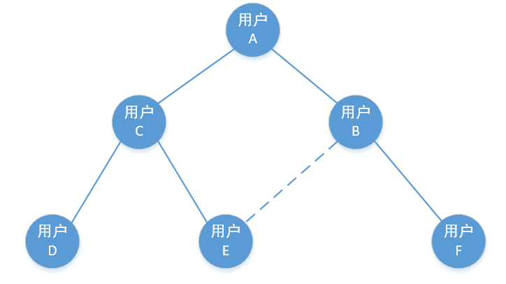

# 设计文档

- - - 

## 一、构思

做一个仅能通过用户分享注册链接才能进入的社交软件，加以分销系统的思路，绘制出用户关系图，用户基于该关系图之上进行社交，可以查看自己的好友，以及好友的好友（最多仅限这层关系），然后根据圈子进行好友匹配，去认识好友的好友。

### 1.1 账号+分销

例如`用户A`邀请了`用户B`注册软件，那么`用户B`就在`用户A`的圈子中，`用户B`属于`用户A`的“下级”（关系网是个图，其实不存在上下级）

### 1.2 用户关系网示意图

### 1.3 功能概述

- 用户邀请/注册/登录
- 直系好友间直接聊天、语音、视频（IM通信）
- 间接好友间添加好友、聊天、语音、视频（IM通信）

先完成这些基础功能